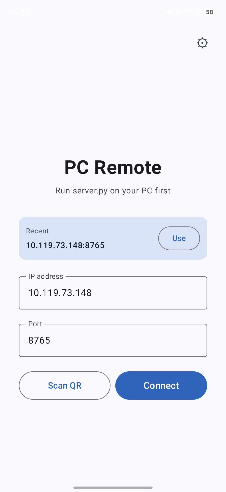
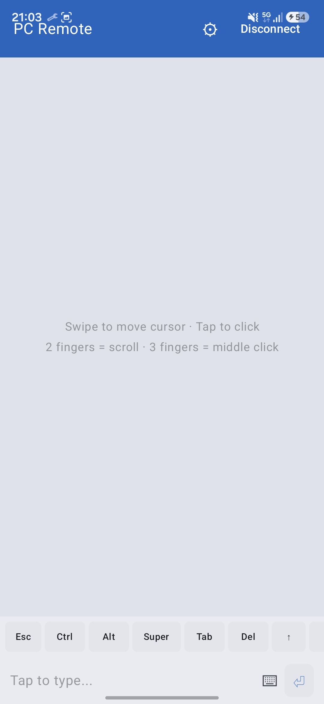
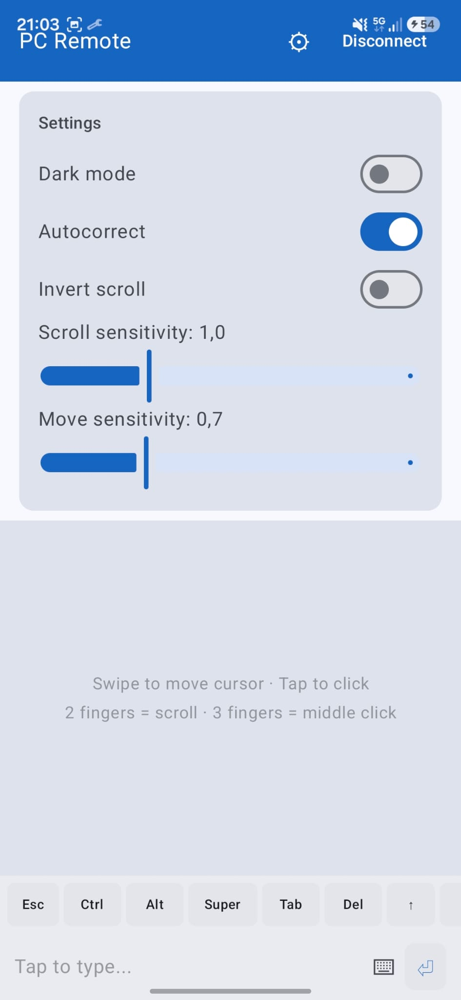
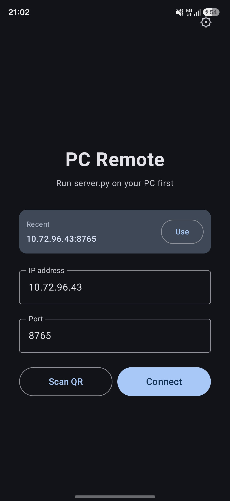
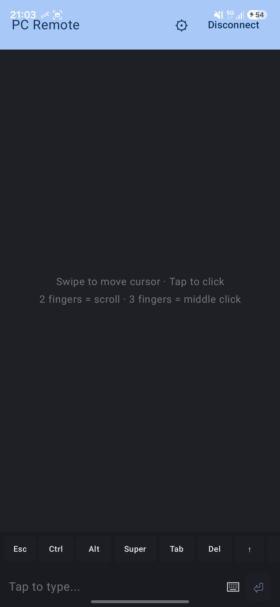
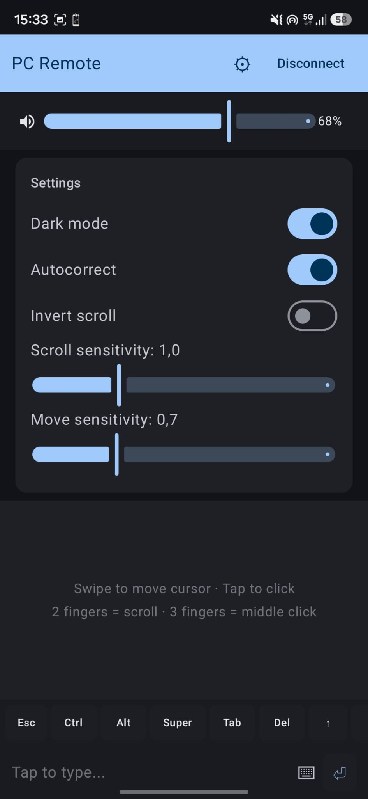

# PcRemote

Control your PC's mouse and keyboard from your Android phone over WiFi. Your phone becomes a trackpad + keyboard. No Bluetooth headaches, no PC installation — just a single Python script.

**Cross-platform:** Works on Linux (Fedora 44, Wayland) and Windows (10/11). Uses the phone's keyboard layout natively (Italian tested, others should work too).

> **v2 (experimental):** Windows support, authentication, heartbeat, system tray, GUI QR, diagnostics. See `v2-experimental-windows` branch.

## Screenshots

### Light mode

<p align="center">
  
  
  
</p>

### Dark mode

<p align="center">
  
  
  
</p>

## How it works

1. Run `server.py` on your PC — it starts a WebSocket server and shows a QR code
2. Open the Android app, scan the QR or type the IP
3. Your phone is now a trackpad and keyboard for the PC

Everything goes over your local WiFi. The companion script uses `uinput` to simulate input at the kernel level, so it works on both X11 and Wayland.

## Features

**Trackpad** (like a laptop touchpad):
- Single finger swipe to move cursor (with acceleration)
- Tap to click, two-finger tap to right-click, three-finger tap to middle-click
- Two-finger vertical and horizontal scroll (direction and sensitivity adjustable)
- Double-tap and hold to drag

**Keyboard:**
- Uses your phone's system keyboard — autocorrect, suggestions, everything
- Extra keys bar with Ctrl, Alt, Super, Esc, Tab, arrows, F1-F12
- Modifier keys work as toggles (Termux-style)

**Quality of life:**
- App stays connected in background with a notification
- "Spegni" button in notification to disconnect
- QR code scan for zero-typing connection
- Remembers last connection, no need to rescan
- Autocorrect toggle in settings
- Scroll sensitivity and invert scroll settings

## Requirements

**PC (Linux):**
- Python 3
- `websockets`, `evdev`, `qrcode`, `pillow` (install with `pip install -r requirements.txt`)
- `qrencode` (optional, for QR code in terminal, `dnf install qrencode` on Fedora)
- `uinput` kernel module loaded (`sudo modprobe uinput`)
- Your user must be in the `input` group for uinput:
  ```bash
  sudo usermod -aG input $USER
  # log out and back in
  ```

**PC (Windows):**
- Windows 10 or 11
- Python 3 (or use the standalone `.exe`)
- Run `run.bat` to auto-install dependencies and start the server
- Optional: run `build.py` to create `PcRemoteServer.exe`

**Phone:**
- Android 8.0 or newer

## Setup

### PC (companion script)

```bash
git clone https://github.com/nulledv2/PcRemote.git
cd PcRemote/companion
pip install -r requirements.txt
python3 server.py
```

On Windows, double-click `run.bat` to auto-install and start. Or build an `.exe`:
```bash
python build.py        # creates dist/PcRemoteServer.exe
start_tray.bat         # launches the .exe minimized to system tray
```

The server prints your IP, port, auth token, and a QR code (GUI window on Windows, terminal on Linux). Scan the QR with the Android app to connect instantly.

### Phone (Android app)

Install the APK from `android/app/build/outputs/apk/debug/app-debug.apk`, or build it yourself:

- You need Android SDK 35 and JDK 21
- `./gradlew assembleDebug` in the `android/` directory

## Project structure

```
PcRemote/
├── companion/
│   ├── server.py              # Entry point - WebSocket server + input simulation
│   ├── run.bat                # Windows: auto-install deps + start
│   ├── build.py               # PyInstaller build script
│   ├── requirements.txt
│   └── pcremote/              # Backend package
│       ├── __init__.py
│       ├── backends/
│       │   ├── base.py        # Abstract backends
│       │   ├── linux.py       # Linux uinput + pactl
│       │   ├── windows.py     # Windows SendInput + media keys
│       │   └── qr.py          # Cross-platform QR code
│       ├── protocol.py        # WebSocket message types
│       ├── config.py          # Persistent config (%APPDATA% / ~/.config)
│       ├── logsetup.py        # Structured logging (console + file)
│       ├── diagnostics.py     # Startup health checks
│       └── tray.py            # Windows system tray support
├── android/                   # Android app (Kotlin + Jetpack Compose)
│   └── ...
└── app icon/
    └── icon.png
```

## Keyboard layout

The server has a full Italian keyboard layout map. When you type on your phone, characters get mapped to the correct physical key positions for an Italian keyboard. If you use a different layout you might need to tweak the `ITALIAN_CHAR_MAP` dictionary in `server.py` — it's just a dict from characters to `(keycode, shift, altgr)` tuples.

## Notes

- The app needs a foreground service to stay connected when you switch apps. You'll see a persistent notification while connected.
- First run on Android 13+ will ask for notification permission — that's for the connection notification.
- QR scanning needs camera permission.
- The `uinput` devices take a few seconds to initialize on some kernels (Fedora's being one of them). Just wait for the "Server running" message.
- Tested on Samsung A56 5G with Fedora 44 Workstation and Windows 11. Your mileage may vary with other setups.

### Windows-specific
- Launch with `--tray` to start minimized in the system tray (requires `pystray` and `pillow`)
- Windows Firewall may block the port on first run — the diagnostic wizard will try to auto-fix it
- If running as Administrator, SendInput may silently fail — run as a normal user
- Unicode characters use `KEYEVENTF_UNICODE` — all characters work regardless of keyboard layout
