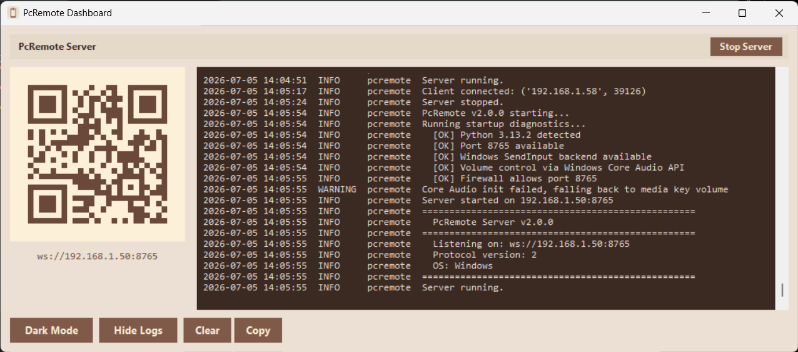
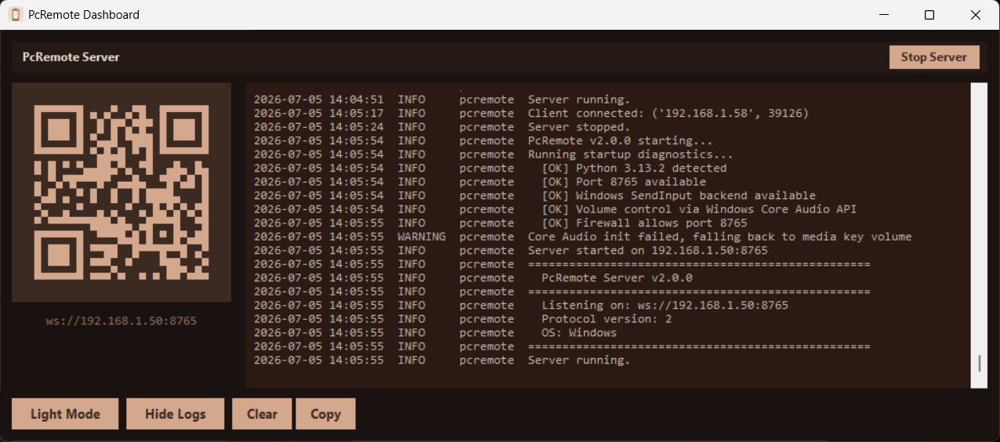
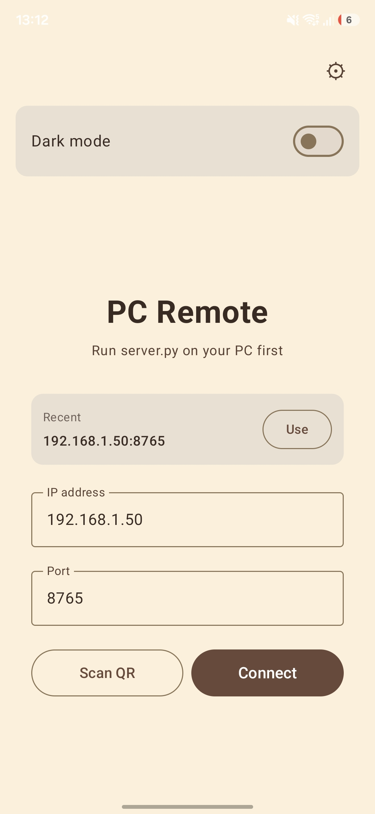
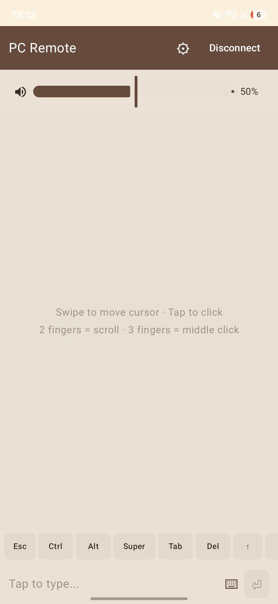
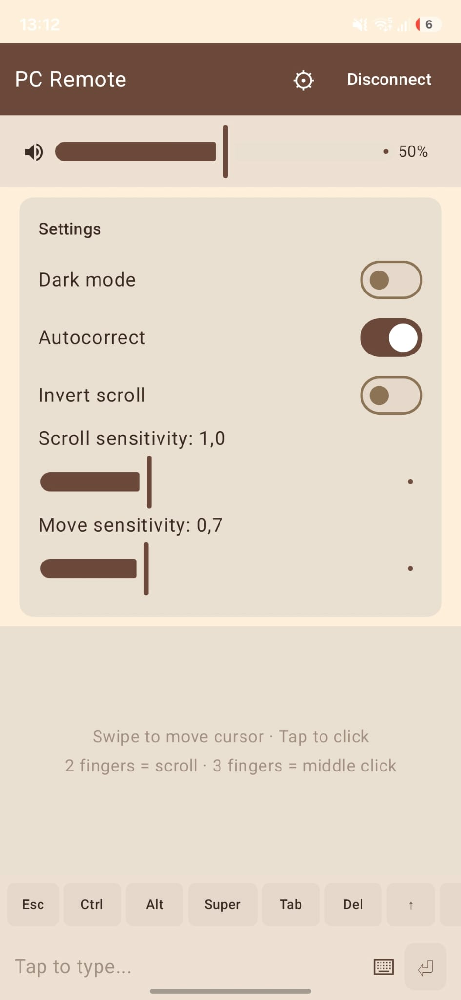
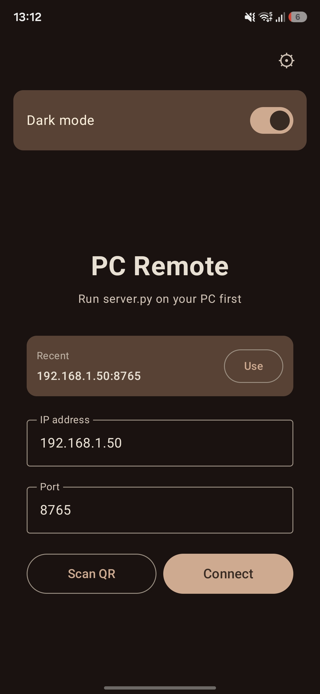
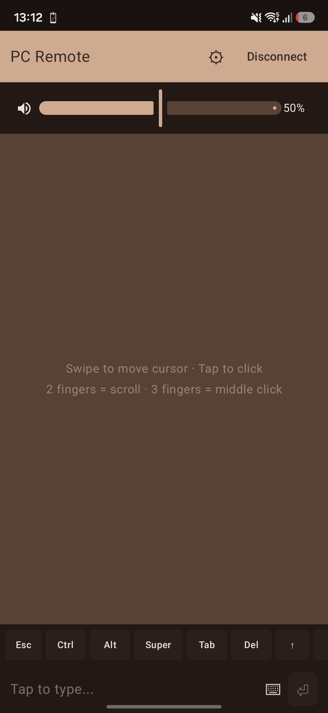
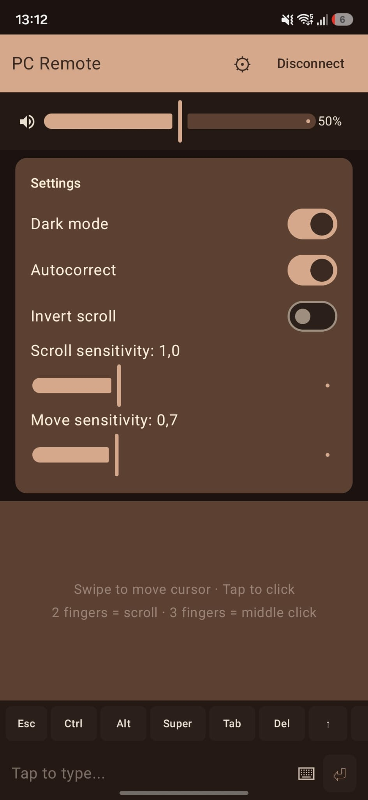

# PcRemote

Use your Android phone as a trackpad and keyboard for your PC over WiFi.
Scan a QR code and you're connected. No Bluetooth, no cables.

<p align="center">
  
  <br>
  <sub>Desktop dashboard — light and dark themes</sub>
</p>

<p align="center">
  
  
  <br>
  <sub>Android app — light theme</sub>
</p>

<p align="center">
  
  
  <br>
  <sub>Android app — dark theme</sub>
</p>

## Features

- Trackpad with adjustable sensitivity and scroll
- Full keyboard (letters, F-keys, media keys, modifiers)
- Real-time volume sync with PC
- QR code pairing -- no passwords, no IP typing
- Windows: system tray, standalone .exe, no Python required
- Linux: uinput + PulseAudio
- Dark and light themes

## Quick start

Download `PcRemoteServer.exe` from [Releases](https://github.com/NulledNah/PcRemote/releases/latest),
double-click, accept the UAC prompt, right-click the tray icon and select Show Dashboard.
Scan the QR code with the Android app.

## Linux

```
git clone https://github.com/NulledNah/PcRemote.git
cd PcRemote/companion
sudo modprobe uinput
pip install -r requirements.txt -r requirements-linux.txt
python3 server.py
```

## Android

Install the APK from [Releases](https://github.com/NulledNah/PcRemote/releases/latest)
or build from source (see [CONTRIBUTING.md](CONTRIBUTING.md)).

## Building from source

See [CONTRIBUTING.md](CONTRIBUTING.md) for build instructions, project structure, and protocol reference.

## License

MIT
