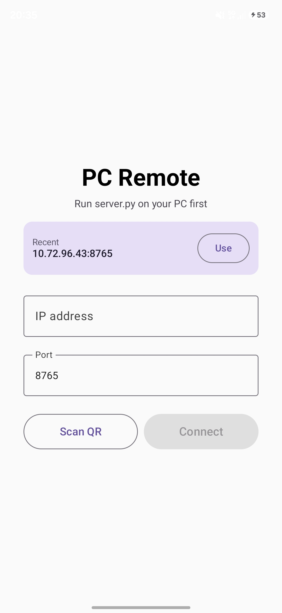
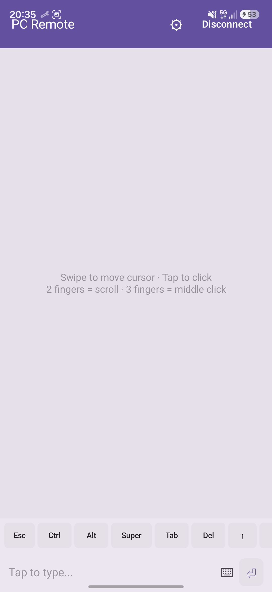
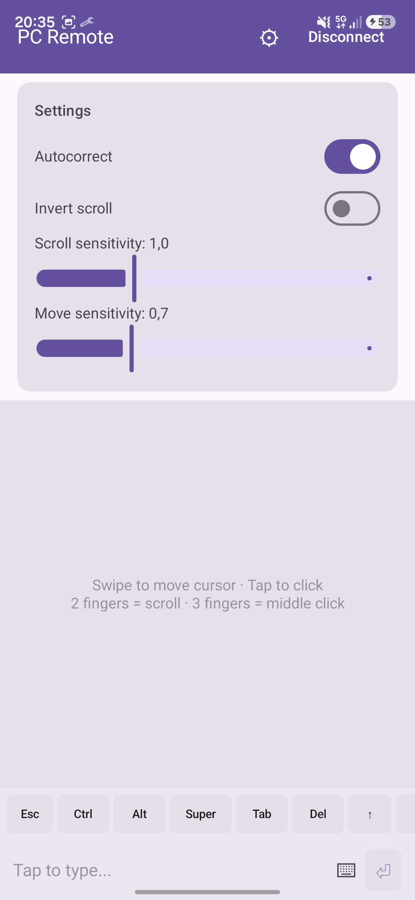

# PcRemote

Control your PC's mouse and keyboard from your Android phone over WiFi. Your phone becomes a trackpad + keyboard. No Bluetooth headaches, no PC installation — just a single Python script.

Works on Linux (tested on Fedora 44 with Wayland). Uses the phone's keyboard layout natively (Italian tested, others should work too).

## Screenshots

<p align="center">
  
  
  
</p>

## How it works

1. Run `server.py` on your PC — it starts a WebSocket server and shows a QR code
2. Open the Android app, scan the QR or type the IP
3. Your phone is now a trackpad and keyboard for the PC

Everything goes over your local WiFi. The companion script uses `uinput` to simulate input at the kernel level, so it works on both X11 and Wayland.

## Features

**Trackpad** (like a laptop touchpad):
- Single finger swipe to move cursor (with acceleration)
- Tap to click, two-finger tap to right-click, three-finger tap to middle-click
- Two-finger vertical and horizontal scroll (direction and sensitivity adjustable)
- Double-tap and hold to drag

**Keyboard:**
- Uses your phone's system keyboard — autocorrect, suggestions, everything
- Extra keys bar with Ctrl, Alt, Super, Esc, Tab, arrows, F1-F12
- Modifier keys work as toggles (Termux-style)

**Quality of life:**
- App stays connected in background with a notification
- "Spegni" button in notification to disconnect
- QR code scan for zero-typing connection
- Remembers last connection, no need to rescan
- Autocorrect toggle in settings
- Scroll sensitivity and invert scroll settings

## Requirements

**PC (Linux):**
- Python 3
- `websockets` and `evdev` (install with `pip install websockets evdev`)
- `qrencode` (for QR code in terminal, `dnf install qrencode` on Fedora)
- `uinput` kernel module loaded (`sudo modprobe uinput`)
- Your user must be in the `input` group for uinput:
  ```bash
  sudo usermod -aG input $USER
  # log out and back in
  ```

**Phone:**
- Android 8.0 or newer

## Setup

### PC (companion script)

```bash
git clone https://github.com/nulledv2/PcRemote.git
cd PcRemote/companion
pip install -r requirements.txt
python3 server.py
```

The server prints your IP, port, and a QR code. If uinput complains about permissions, check the group thing above.

### Phone (Android app)

Install the APK from `android/app/build/outputs/apk/debug/app-debug.apk`, or build it yourself:

- You need Android SDK 35 and JDK 21
- `./gradlew assembleDebug` in the `android/` directory

## Project structure

```
PcRemote/
├── companion/
│   ├── server.py          # WebSocket server + input simulation
│   └── requirements.txt
├── android/               # Android app (Kotlin + Jetpack Compose)
│   ├── app/
│   │   ├── build.gradle.kts
│   │   └── src/main/
│   │       ├── AndroidManifest.xml
│   │       └── java/com/example/pcremote/
│   │           ├── MainActivity.kt
│   │           ├── ConnectionService.kt    # Foreground service
│   │           ├── network/               # WebSocket client
│   │           ├── viewmodel/
│   │           └── ui/                    # All screens and components
│   ├── build.gradle.kts
│   └── settings.gradle.kts
└── app icon/
    └── icon.png
```

## Keyboard layout

The server has a full Italian keyboard layout map. When you type on your phone, characters get mapped to the correct physical key positions for an Italian keyboard. If you use a different layout you might need to tweak the `ITALIAN_CHAR_MAP` dictionary in `server.py` — it's just a dict from characters to `(keycode, shift, altgr)` tuples.

## Notes

- The app needs a foreground service to stay connected when you switch apps. You'll see a persistent notification while connected.
- First run on Android 13+ will ask for notification permission — that's for the connection notification.
- QR scanning needs camera permission.
- The `uinput` devices take a few seconds to initialize on some kernels (Fedora's being one of them). Just wait for the "Server running" message.
- Tested on Samsung A56 5G with Fedora 44 Workstation. Your mileage may vary with other setups.
